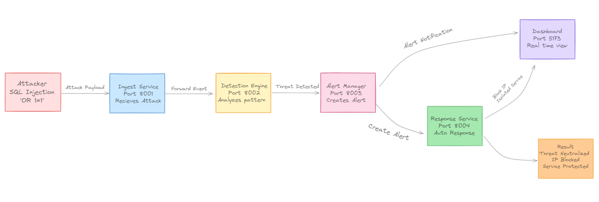

# 🛡️ Server Guard
### ML-Driven Cyber-Resilient Server Security Platform


## 📖 Overview

**Server Guard** is an automated **SOAR** (Security Orchestration, Automation, and Response) platform designed to shift server security from passive monitoring to active defense. 

Unlike traditional tools that simply alert you *after* a breach, Server Guard monitors system telemetry in real-time, leverages **Machine Learning** to intercept attacks (like SQL Injection, DDoS, and Brute Force) before they execute, and visualizes everything through a high-performance SOC-style dashboard.

---

## 🚀 Key Features

*   **⚡ Active Defense:** Real-time threat detection and mitigation pipeline.
*   **🧠 AI-Powered Detection:**
    *   **Web Gatekeeper:** Random Forest Classifier & TF-IDF Vectorization to block SQL Injection (SQLi) and XSS payload attacks.
    *   **Network Shield:** PyTorch-based Deep Learning model to detect DDoS patterns and anomalous traffic flows.
*   **📡 Real-Time Telemetry:** Continuous ingestion of system metrics (CPU, RAM, Network) and logs via WebSockets.
*   **🚨 Automated Response:** 
    *   Instant IP Blocking via central IP Manager.
    *   Service Isolation and rate limiting.
    *   Syncs defensive actions across the fleet (Multi-Laptop support).
*   **🖥️ Unified SOC Dashboard:** sleek React-based UI for visualizing attacks, system health, and blocked threats live.
*   **🧱 Microservices Architecture:** Scalable, modular design separating ingestion, detection, and response.
*   **🛡️ Multi-Vector Protection:** Robust defense against SQL Injection (SQLi), Cross-Site Scripting (XSS), DDoS, Port Scanning, and Resource Exhaustion.

---


## 🏗️ Architecture
The system utilizes a scalable **Agent → Ingest → AI → Response** pipeline:

**Client** → **Gateway** → **Ingest** → **Detection (AI)** → **Alert** → **Response** → **Gateway (Mitigation)**

### System Workflow
Below illustrates the high-level workflow of the system from attack initiation to automated defense.



---

## 📊 Datasets Used

We leverage high-quality cybersecurity datasets to train our AI models for accurate threat detection:

| Dataset | Use Case | Description |
| :--- | :--- | :--- |
| **[sajid576/sql-injection-dataset](https://www.kaggle.com/datasets/sajid576/sql-injection-dataset)** | **SQL Injection Detection** | Used to train the Web Gatekeeper model to identify malicious SQL query patterns. |
| **[syedsaqlainhussain/cross-site-scripting-xss-dataset](https://www.kaggle.com/datasets/syedsaqlainhussain/cross-site-scripting-xss-dataset)** | **XSS Detection** | Provides diverse XSS payloads for detecting malicious script injections. |
| **[Friday-WorkingHours-Afternoon-DDos](https://www.kaggle.com/datasets/cicdataset/cicids2017)** | **DDoS Detection** | A subset of the CIC-IDS2017 dataset used to train the Network Shield for traffic anomaly and flood detection. |

---

## 🧩 Microservices Breakdown

| Service | Port | Description | Tech Stack |
| :--- | :--- | :--- | :--- |
| **Dashboard** | `8000` | User Interface for monitoring and control. | Flask, React (Static) |
| **API Gateway** | `3001` | Central entry point, Socket.IO bridge, and IP Manager. | FastAPI, Socket.IO |
| **Ingest Service** | `8001` | High-throughput telemetry ingestion & local storage. | FastAPI, AsyncIO |
| **Detection Engine** | `8002` | Analyzes events using Rules + ML Models. | FastAPI, PyTorch |
| **Alert Manager** | `8003` | Aggregates anomalies and generates structured alerts. | FastAPI |
| **Response Engine** | `8004` | Executes playbooks (Block IP, Throttle) and syncs state. | FastAPI |
| **Model Service** | `8006` | Dedicated inference server for AI models. | Flask, Scikit-learn, Torch |

---

## 🛠️ Installation & Setup

### Prerequisites
*   **Python 3.9+**
*   **Node.js** (Optional, for frontend dev)
*   Windows/Linux/MacOS

### 1. Clone the Repository
```bash
git clone https://github.com/yourusername/Server-Guard.git
cd Server-Guard
```

### 2. Install Dependencies
Each microservice is Python-based. You can install all dependencies:

```bash
# Example for one service (repeat or use a master script)
pip install -r backend/api-gateway/requirements.txt
pip install -r backend/detection-engine/requirements.txt
# ... etc
```

### 3. Start the Platform
We provide a unified orchestration script to start all services in the correct order.

```bash
# From the root directory
python start_services.py
```

This will launch:
1.  Ingest Service
2.  Detection Engine
3.  Alert Manager
4.  Response Engine
5.  Model Service
6.  API Gateway
7.  Dashboard

### 4. Access the Dashboard
Open your browser and navigate to:
**http://localhost:8000**

---

## 🔌 API Documentation

### API Gateway (`http://localhost:3001`)
*   `GET /health`: System status and connected clients.
*   `POST /ip/block`: Manually block an IP address.
*   `GET /proxy/logs`: Fetch recent telemetry logs.

### Ingest Service (`http://localhost:8001`)
*   `POST /ingest`: Send raw telemetry data.
*   `GET /events`: List stored events.

### Response Engine (`http://localhost:8004`)
*   `POST /execute`: Run response playbooks for a specific alert.
*   `GET /actions`: View history of automated actions taken.

---

## 💻 Tech Stack

| Category | Tools |
| :--- | :--- |
| **Backend Framework** | Python, FastAPI, Uvicorn, Flask |
| **Real-time Comms** | Socket.IO, AsyncIO |
| **Machine Learning** | PyTorch (Neural Nets), Scikit-learn (Random Forest), Pandas, NumPy |
| **Frontend** | React, Chart.js, HTML5/CSS3 |
| **System Info** | Psutil |

---

## ☁️ Render Deployment (Free Tier)

Server Guard can be deployed on [Render](https://render.com) using the free tier. The `render.yaml` blueprint file configures a **unified standalone deployment** with all services (frontend + backend) in a single container.

### Architecture: Unified Standalone Deployment

The unified deployment combines:
- **Frontend**: React dashboard served via Nginx
- **Backend Services**: All microservices running in a single container
  - API Gateway (main entry point, Socket.IO)
  - Ingest Service (telemetry ingestion)
  - Detection Engine (ML-powered threat detection)
  - Alert Manager (alert aggregation)
  - Response Engine (automated response/SOAR)
  - Model Service (AI inference)

All services communicate via localhost within the container, with Nginx handling external traffic.

### Prerequisites
- A Render account (free tier works)
- This repository connected to your Render account

### Deploy to Render

1. **Fork or clone this repository** to your GitHub account

2. **Connect to Render**
   - Go to [Render Dashboard](https://dashboard.render.com)
   - Click "New" → "Blueprint"
   - Select your repository
   - Render will automatically detect `render.yaml`

3. **Deploy**
   - Click "Apply" to create the unified service
   - Wait for the build and deployment (first deploy may take 10-15 minutes)

### Service URL After Deployment

| Service | URL Pattern |
| :--- | :--- |
| Server Guard (Unified) | `https://server-guard.onrender.com` |

All endpoints are available from the single URL:
- Dashboard: `https://server-guard.onrender.com/`
- API: `https://server-guard.onrender.com/api/`
- Socket.IO: `https://server-guard.onrender.com/socket.io/`
- Health: `https://server-guard.onrender.com/health`

### Free Tier Limitations

- **Cold Starts**: Free tier services spin down after 15 minutes of inactivity. First request after idle may take 30-60 seconds.
- **Memory**: Limited to 512MB RAM per service. The ML model service uses CPU-only PyTorch to reduce memory usage.
- **Ephemeral Storage**: Data stored in the file system is not persistent. Events are stored in memory/temp files.
- **Concurrent Connections**: Limited concurrent connections on free tier.

### Keeping Services Warm (Optional)

To prevent cold starts, you can use a service like [UptimeRobot](https://uptimerobot.com/) to ping your service every 5-10 minutes:
- Ping `https://server-guard.onrender.com/health`

---
